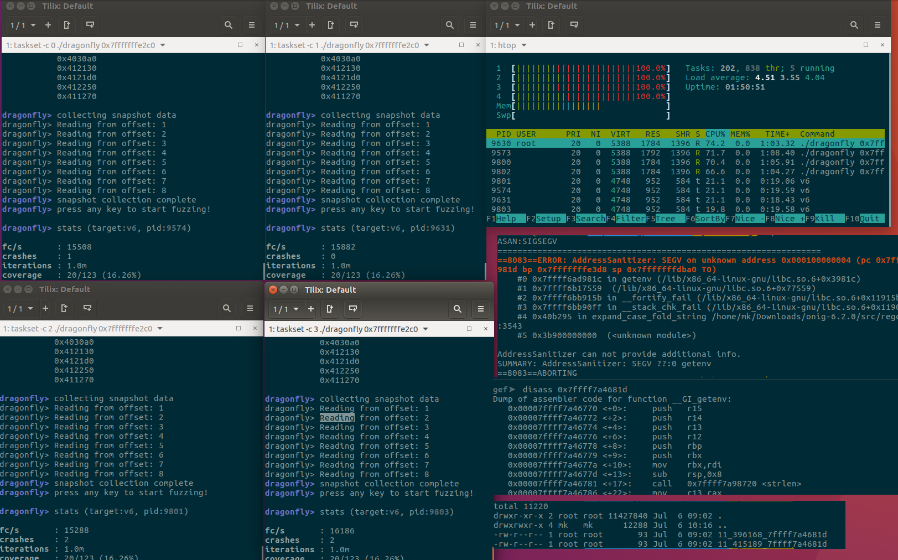
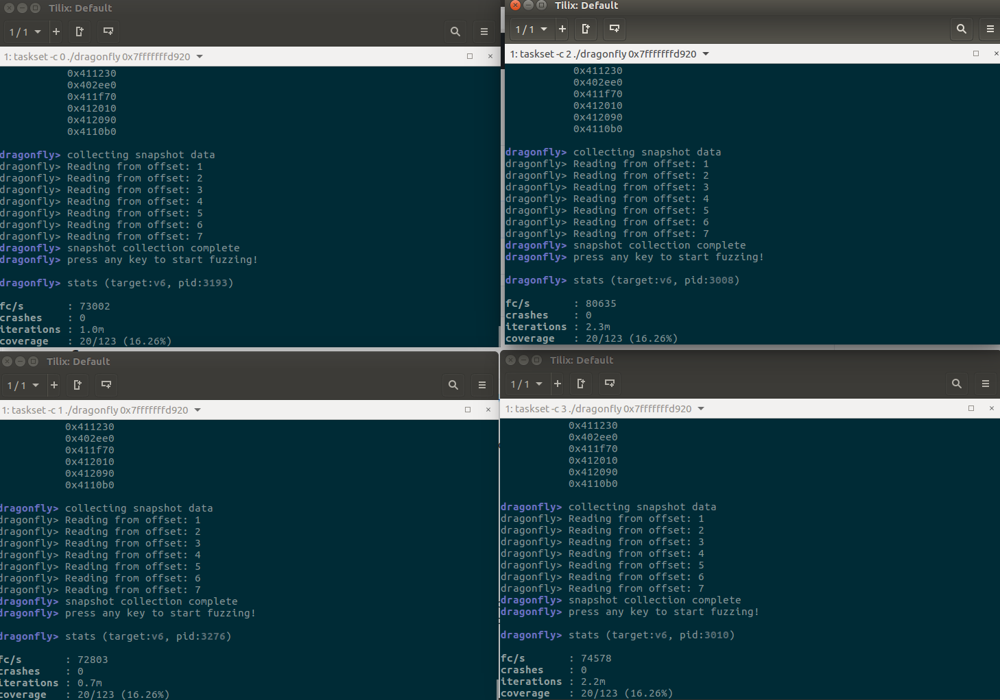

# fuzzer
Ptrace fuzzer experiments based on https://h0mbre.github.io/Fuzzing-Like-A-Caveman-4/#

- Modified it to snapshot also Heap (needed for a more real target than dummy one)
- Modified it to snapshot and restore FP (Floating Point) registers along General Purpose registers
- Fixed small bug with percentage showing of Coverage
- debuged, debuged, debuged till it work with real target (Oniguruma library :))


TODO:
- automatic snapshot collection from /proc/maps - DONE
- shared memory for Corpus - DONE (Brought 4x speed increase 120k exec per second on one core and ca 70k exec per second per core with 4 cores)
- Mutators

Fuzzing at ca. 60k exec/s. I can imagine you can scale it even more with 25% drop per total cores. With 4 cores I achieved 60k exec/s (25% total drop, since 1 core was ca 20k). Below you can also see how I trigger Stack Protector with my crash. #fuzzing #speed Fuzzing older "Oniguruma" regular expression library

# Setup

Dont forget to:

```
sudo echo 0 | sudo tee /proc/sys/kernel/randomize_va_space
```

Thats how proc maps looked on my system (see snapshot.c)

```
cat /proc/30918/maps | grep rw
0065f000-00664000 rw-p 0005f000 00:34 7868250                            /home/mk/fuzzer/v6
00664000-00685000 rw-p 00000000 00:00 0                                  [heap]
7ffff7dd1000-7ffff7dd3000 rw-p 001c4000 fd:01 13908802                   /lib/x86_64-linux-gnu/libc-2.23.so
7ffff7dd3000-7ffff7dd7000 rw-p 00000000 00:00 0 
7ffff7fc5000-7ffff7fc8000 rw-p 00000000 00:00 0 
7ffff7ffd000-7ffff7ffe000 rw-p 00026000 fd:01 13908788                   /lib/x86_64-linux-gnu/ld-2.23.so
7ffff7ffe000-7ffff7fff000 rw-p 00000000 00:00 0 
7ffffffde000-7ffffffff000 rw-p 00000000 00:00 0                          [stack]
```

Hopefully, rest you can figure out.




After moving Corpus to shared memory




